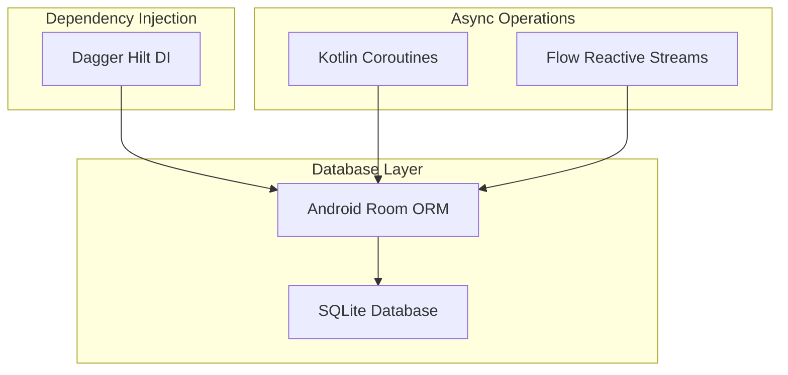

# 🗄️ CuraTrack Project Database Configuration

## 📊 **Actual Database Setup Used**

Based on your project structure, here's the **exact database configuration** currently implemented:

## 🏗️ **Database Technology Stack**



## 📦 **Dependencies Used (from build.gradle.kts)**

```kotlin
dependencies {
    // Room Database - Version 2.6.1
    implementation("androidx.room:room-runtime:2.6.1")     // Core Room runtime
    implementation("androidx.room:room-ktx:2.6.1")         // Kotlin extensions & Coroutines support
    ksp("androidx.room:room-compiler:2.6.1")               // Annotation processor

    // Dependency Injection - Hilt Version 2.52
    implementation("com.google.dagger:hilt-android:2.52")
    ksp("com.google.dagger:hilt-compiler:2.52")
    
    // Other related dependencies
    implementation("androidx.datastore:datastore-preferences:1.0.0")  // For session storage
    implementation("androidx.work:work-runtime-ktx:2.9.1")            // Background tasks
}
```

## 🏛️ **Database Architecture**

### **AppDatabase.kt - Main Database Configuration**
```kotlin
@Database(
    entities = [
        UserEntity::class, 
        MedicineEntity::class, 
        ScheduleEntity::class, 
        DoseEntity::class
    ],
    version = 3,                    // Current database version
    exportSchema = false            // Don't export schema for now
)
abstract class AppDatabase : RoomDatabase() {
    abstract fun userDao(): UserDao
    abstract fun medicineDao(): MedicineDao
    abstract fun scheduleDao(): ScheduleDao
}
```

### **Database Configuration in AuthModule.kt**
```kotlin
@Provides
@Singleton
fun provideDatabase(@ApplicationContext context: Context): AppDatabase =
    Room.databaseBuilder(context, AppDatabase::class.java, "curatrack.db")
        .fallbackToDestructiveMigration()    // Development mode - drops DB on version changes
        .build()
```

## 🗂️ **Database Schema**

### **4 Core Tables:**

```sql
-- 1. Users Table
CREATE TABLE users (
    id INTEGER PRIMARY KEY AUTOINCREMENT,
    email TEXT UNIQUE NOT NULL,
    password_hash TEXT NOT NULL,
    created_at INTEGER NOT NULL,
    updated_at INTEGER NOT NULL
);

-- 2. Medicines Table
CREATE TABLE medicines (
    id TEXT PRIMARY KEY,              -- UUID
    userId INTEGER NOT NULL,          -- FK to users
    name TEXT NOT NULL,
    dosage TEXT NOT NULL,
    form TEXT NOT NULL,
    instructions TEXT,
    color TEXT,
    icon TEXT,
    active INTEGER DEFAULT 1,        -- Soft delete flag
    created_at INTEGER NOT NULL,
    updated_at INTEGER NOT NULL,
    
    FOREIGN KEY (userId) REFERENCES users(id)
);

-- 3. Schedules Table
CREATE TABLE schedules (
    id TEXT PRIMARY KEY,              -- UUID
    userId INTEGER NOT NULL,          -- FK to users
    medicineId TEXT NOT NULL,         -- FK to medicines
    startDateEpochMillis INTEGER NOT NULL,
    endDateEpochMillis INTEGER,       -- Nullable end date
    timezoneId TEXT NOT NULL,
    frequencyType TEXT NOT NULL,     -- "TIMES_PER_DAY", "INTERVAL", "WEEKLY"
    timesJson TEXT,                  -- JSON array of times
    intervalMinutes INTEGER,
    daysOfWeekJson TEXT,            -- JSON array of weekdays
    exactAlarm INTEGER DEFAULT 1,
    created_at INTEGER NOT NULL,
    updated_at INTEGER NOT NULL,
    
    FOREIGN KEY (userId) REFERENCES users(id),
    FOREIGN KEY (medicineId) REFERENCES medicines(id) ON DELETE CASCADE
);

-- 4. Doses Table (Generated from Schedules)
CREATE TABLE doses (
    id TEXT PRIMARY KEY,              -- UUID
    scheduleId TEXT NOT NULL,         -- FK to schedules
    timeEpochMillis INTEGER NOT NULL, -- When to take the dose
    generatedFrom TEXT NOT NULL,      -- "SCHEDULE" or "MANUAL"
    
    FOREIGN KEY (scheduleId) REFERENCES schedules(id) ON DELETE CASCADE
);
```

## 🔌 **Dependency Injection Setup**

### **Database Provider (AuthModule.kt)**
```kotlin
@Module
@InstallIn(SingletonComponent::class)
object AuthModule {
    
    // Main database instance
    @Provides
    @Singleton
    fun provideDatabase(@ApplicationContext context: Context): AppDatabase =
        Room.databaseBuilder(context, AppDatabase::class.java, "curatrack.db")
            .fallbackToDestructiveMigration()
            .build()

    // DAO providers
    @Provides
    fun provideUserDao(db: AppDatabase): UserDao = db.userDao()
    
    @Provides
    fun provideMedicineDao(db: AppDatabase): MedicineDao = db.medicineDao()
}
```

### **Repository Providers**
```kotlin
// MedicineModule.kt
@Provides
@Singleton
fun provideMedicineRepository(medicineDao: MedicineDao): MedicineRepository {
    return MedicineRepository(medicineDao)
}

// ScheduleModule.kt  
@Provides
@Singleton
fun provideScheduleRepository(dao: ScheduleDao): ScheduleRepository = 
    ScheduleRepository(dao)
```

## 📁 **File Structure**

```
app/src/main/java/com/curatrack/app/
├── core/
│   └── db/
│       └── AppDatabase.kt           # Main database configuration
├── auth/
│   ├── data/
│   │   ├── UserEntity.kt           # User table entity
│   │   ├── UserDao.kt              # User data access
│   │   └── AuthRepository.kt       # Auth business logic
│   └── di/
│       └── AuthModule.kt           # Database DI configuration
├── medicine/
│   ├── data/
│   │   ├── MedicineEntity.kt       # Medicine table entity
│   │   ├── MedicineDao.kt          # Medicine data access
│   │   └── MedicineRepository.kt   # Medicine business logic
│   └── di/
│       └── MedicineModule.kt       # Medicine DI
└── schedule/
    ├── data/
    │   ├── ScheduleEntity.kt       # Schedule table entity
    │   ├── DoseEntity.kt           # Dose table entity
    │   ├── DoseProjection.kt       # Query projection
    │   ├── ScheduleDao.kt          # Schedule data access
    │   └── ScheduleRepository.kt   # Schedule business logic
    └── di/
        └── ScheduleModule.kt       # Schedule DI
```

## 🚀 **Key Features Used**

### **✅ Room ORM Benefits**
- **Type Safety**: Compile-time SQL validation
- **Reactive Queries**: Flow-based reactive streams
- **Coroutines Support**: Suspend functions for async operations
- **Migration Support**: Version control for database schema
- **Foreign Keys**: Referential integrity with cascade operations

### **✅ Dependency Injection (Hilt)**
- **Singleton Database**: Single instance across the app
- **Automatic DAO Injection**: DAOs provided to repositories
- **Module Organization**: Separate modules for each feature

### **✅ Modern Android Architecture**
- **Repository Pattern**: Clean separation of concerns
- **Reactive Streams**: Flow for real-time UI updates
- **MVVM**: ViewModels with LiveData/StateFlow
- **Clean Architecture**: UI → Repository → DAO → Database

## 📊 **Database File Location**

```bash
# On Android device/emulator:
/data/data/com.curatrack.app/databases/curatrack.db

# For debugging, you can pull the database file:
adb pull /data/data/com.curatrack.app/databases/curatrack.db ./curatrack.db
```

## 🔧 **Development Configuration**

### **Current Settings:**
- **Database Name**: `curatrack.db`
- **Version**: `3` (current)
- **Migration Strategy**: `fallbackToDestructiveMigration()` (development)
- **Export Schema**: `false` (no schema export)
- **Thread Safety**: Handled by Room automatically

### **For Production:**
```kotlin
// Recommended production configuration:
Room.databaseBuilder(context, AppDatabase::class.java, "curatrack.db")
    .addMigrations(MIGRATION_1_2, MIGRATION_2_3)  // Proper migrations
    .build()
```

## 🔄 **Data Flow in Your Project**

```
UI Layer (Composable)
    ↓
ViewModel (StateFlow)
    ↓
Repository (Business Logic)
    ↓
DAO (Room Interface)
    ↓
Room Database (ORM)
    ↓
SQLite Database (curatrack.db)
```

## 📈 **Performance Optimizations Used**

1. **Reactive Queries**: Using Flow for automatic UI updates
2. **Background Threading**: Room handles threading automatically
3. **Connection Pooling**: Room manages SQLite connections
4. **Lazy Loading**: Data loaded only when accessed
5. **Foreign Keys**: Efficient JOINs for related data

## 🛠️ **Tools for Database Inspection**

### **Android Studio Database Inspector**
- View database content in real-time
- Execute SQL queries
- Monitor database operations

### **ADB Commands**
```bash
# Connect to device
adb shell

# Navigate to database directory
cd /data/data/com.curatrack.app/databases/

# List database files
ls -la
```

This is the **exact database configuration** used in your CuraTrack project! 🎯