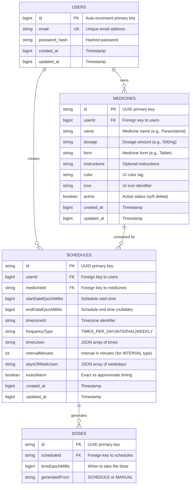
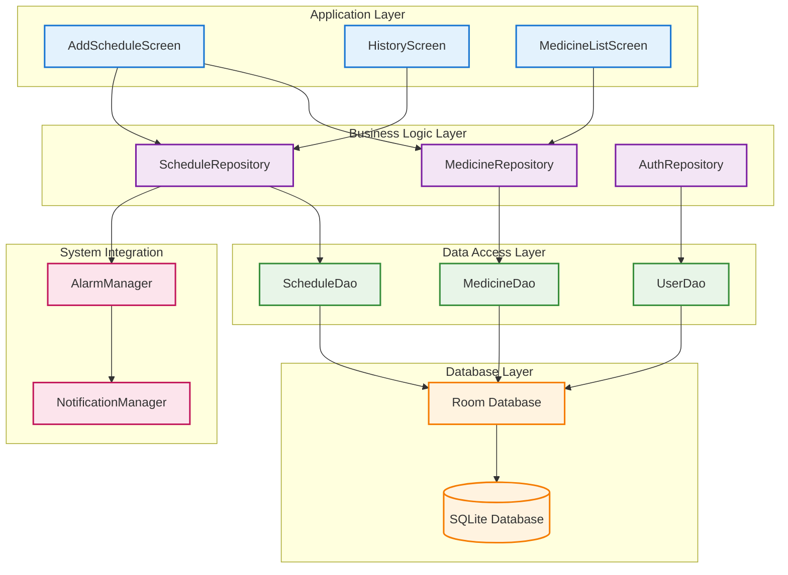

# 🗄️ CuraTrack Database Entity Relationship Diagram

## 📊 Entity Relationship Diagram (ERD)



## 🔗 Database Connectivity Architecture



## 🔧 Detailed Connection Specifications

### **Room Database Configuration**
```kotlin
// Database connection configuration
@Database(
    entities = [UserEntity::class, MedicineEntity::class, ScheduleEntity::class, DoseEntity::class],
    version = 1
)
abstract class CuraTrackDatabase : RoomDatabase() {
    
    // Connection pool management
    companion object {
        @Volatile
        private var INSTANCE: CuraTrackDatabase? = null
        
        fun getDatabase(context: Context): CuraTrackDatabase {
            return INSTANCE ?: synchronized(this) {
                Room.databaseBuilder(
                    context.applicationContext,
                    CuraTrackDatabase::class.java,
                    "curatrack_database"
                )
                .addMigrations(/* future migrations */)
                .fallbackToDestructiveMigration() // Development only
                .build()
            }
        }
    }
}
```

### **Repository Connection Pattern**
```kotlin
// Dependency Injection for database connections
@Singleton
class MedicineRepository @Inject constructor(
    private val medicineDao: MedicineDao
) {
    // Reactive data streams
    fun getMedicines(userId: Long): Flow<List<MedicineEntity>> = 
        medicineDao.getMedicinesByUser(userId)
    
    // Transactional operations
    suspend fun addMedicine(medicine: MedicineEntity) = 
        medicineDao.insert(medicine)
}
```

## 📋 Data Flow Mapping

### **Create Schedule Flow**
```
AddScheduleScreen
    ↓ (user input)
ScheduleRepository.createOrUpdateSchedule()
    ↓ (validate & transform)
ScheduleDao.upsertSchedule()
    ↓ (Room ORM)
SQLite INSERT INTO schedules
    ↓ (generate doses)
ScheduleDao.upsertDoses()
    ↓ (Room ORM)
SQLite INSERT INTO doses (multiple)
    ↓ (schedule alarms)
AlarmManager.setExact()
```

### **History Display Flow**
```
HistoryScreen.onAppear
    ↓ (request data)
ScheduleRepository.getUpcomingDoses()
    ↓ (reactive query)
ScheduleDao.getUpcomingDoseProjections()
    ↓ (complex JOIN)
SQLite SELECT with JOINs
    ↓ (stream results)
Flow<List<DoseProjection>>
    ↓ (UI binding)
LazyColumn with medicine details
```

## 🎯 Connection Optimization Strategies

### **Database Performance**
1. **Connection Pooling**: Room manages SQLite connections efficiently
2. **Query Optimization**: Strategic indexes on frequently queried columns
3. **Lazy Loading**: Data loaded only when UI components need it
4. **Caching**: Repository layer caches frequently accessed entities

### **Memory Management**
1. **Flow-based Reactive**: Prevents memory leaks with automatic cleanup
2. **Pagination**: Large datasets loaded in chunks
3. **Background Threading**: Database operations off main UI thread
4. **Transaction Management**: Atomic operations for data consistency

### **Real-time Updates**
```kotlin
// Reactive data binding
@Composable
fun HistoryScreen(repo: ScheduleRepository) {
    // Automatically updates when database changes
    val upcomingDoses by repo.getUpcomingDoses(userId)
        .collectAsState(initial = emptyList())
    
    LazyColumn {
        items(upcomingDoses) { dose ->
            DoseCard(dose) // UI updates automatically
        }
    }
}
```

## 🔒 Data Security & Integrity

### **Security Measures**
- **SQL Injection Prevention**: Parameterized queries through Room
- **User Isolation**: All queries filtered by userId
- **Password Security**: Bcrypt hashing for user passwords
- **Local Storage**: SQLite database stored in app's private directory

### **Data Integrity**
- **Foreign Key Constraints**: Maintain referential integrity
- **Cascade Deletes**: Proper cleanup when parent entities deleted
- **Transaction Atomicity**: All-or-nothing operations
- **Validation**: Entity validation before database operations

### **Backup & Migration**
```kotlin
// Database migration strategy
val MIGRATION_1_2 = object : Migration(1, 2) {
    override fun migrate(database: SupportSQLiteDatabase) {
        database.execSQL("ALTER TABLE medicines ADD COLUMN category TEXT")
    }
}

// Backup capabilities
Room.databaseBuilder(context, CuraTrackDatabase::class.java, "curatrack_db")
    .addMigrations(MIGRATION_1_2)
    .build()
```

This comprehensive database connectivity system ensures reliable, scalable, and secure medicine scheduling data management! 🚀