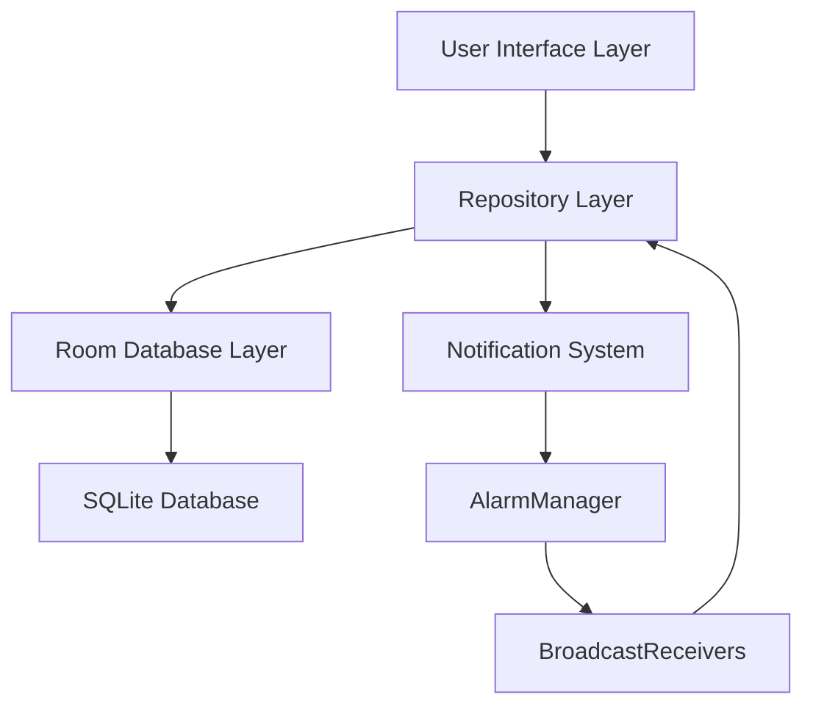
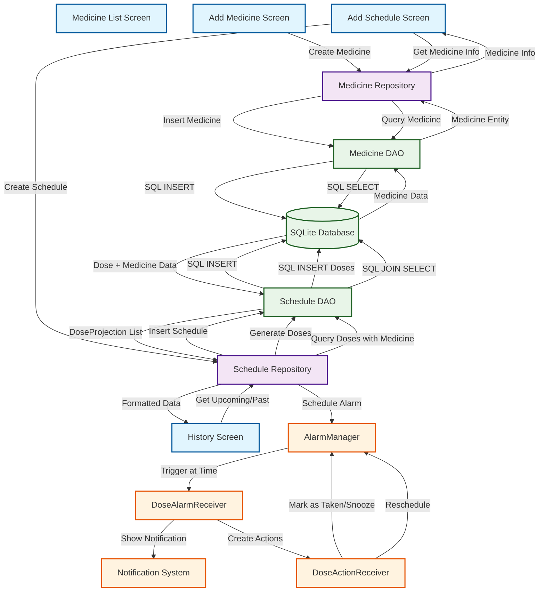
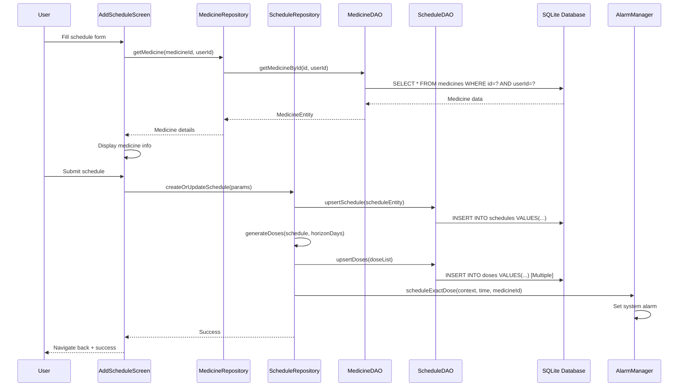
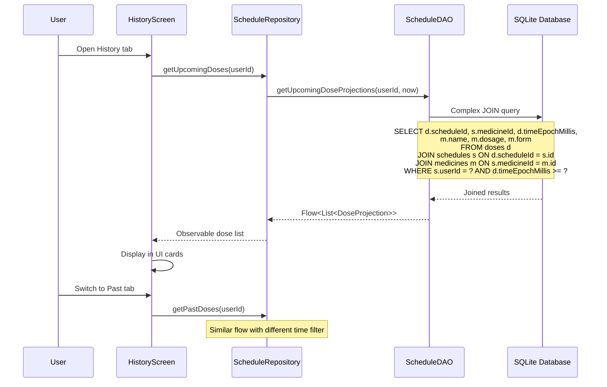
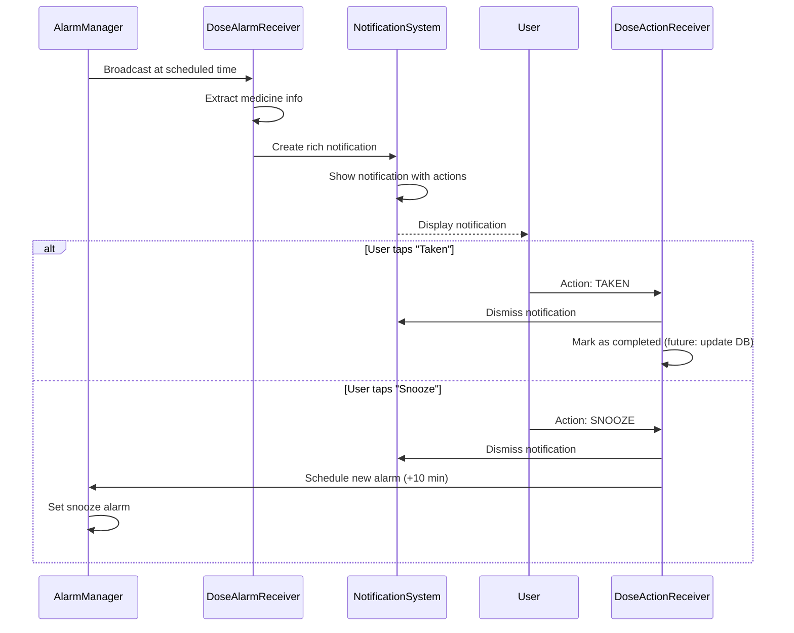

# 📊 CuraTrack Data Flow Diagram & Database Connectivity

## 🏗️ System Architecture Overview



## 📱 Complete Data Flow Diagram



## 🗄️ Database Schema & Connectivity

### **Database Tables Structure**

```sql
-- Users Table (handled by Auth system)
CREATE TABLE users (
    id INTEGER PRIMARY KEY AUTOINCREMENT,
    email TEXT UNIQUE NOT NULL,
    password_hash TEXT NOT NULL,
    created_at INTEGER NOT NULL,
    updated_at INTEGER NOT NULL
);

-- Medicines Table
CREATE TABLE medicines (
    id TEXT PRIMARY KEY,                 -- UUID string
    userId INTEGER NOT NULL,             -- Foreign key to users
    name TEXT NOT NULL,                  -- e.g., "Paracetamol"
    dosage TEXT NOT NULL,                -- e.g., "500mg"
    form TEXT NOT NULL,                  -- e.g., "Tablet"
    instructions TEXT,                   -- e.g., "After meals"
    color TEXT,                          -- UI color tag
    icon TEXT,                           -- UI icon identifier
    active INTEGER DEFAULT 1,           -- Boolean: 1=active, 0=deleted
    created_at INTEGER NOT NULL,        -- Timestamp
    updated_at INTEGER NOT NULL,        -- Timestamp
    
    FOREIGN KEY (userId) REFERENCES users(id)
);

-- Schedules Table
CREATE TABLE schedules (
    id TEXT PRIMARY KEY,                 -- UUID string
    userId INTEGER NOT NULL,             -- Foreign key to users
    medicineId TEXT NOT NULL,            -- Foreign key to medicines
    startDateEpochMillis INTEGER NOT NULL,
    endDateEpochMillis INTEGER,          -- NULL = no end date
    timezoneId TEXT NOT NULL,            -- e.g., "America/New_York"
    frequencyType TEXT NOT NULL,        -- "TIMES_PER_DAY", "INTERVAL", "WEEKLY"
    timesJson TEXT,                      -- JSON: ["08:00","20:00"]
    intervalMinutes INTEGER,             -- For INTERVAL type
    daysOfWeekJson TEXT,                 -- JSON: ["MON","WED","FRI"]
    exactAlarm INTEGER DEFAULT 1,       -- Boolean: precise vs approximate
    created_at INTEGER NOT NULL,
    updated_at INTEGER NOT NULL,
    
    FOREIGN KEY (userId) REFERENCES users(id),
    FOREIGN KEY (medicineId) REFERENCES medicines(id) ON DELETE CASCADE
);

-- Doses Table (Generated from Schedules)
CREATE TABLE doses (
    id TEXT PRIMARY KEY,                 -- UUID string
    scheduleId TEXT NOT NULL,            -- Foreign key to schedules
    timeEpochMillis INTEGER NOT NULL,    -- When to take the dose
    generatedFrom TEXT NOT NULL,         -- "SCHEDULE" or "MANUAL"
    
    FOREIGN KEY (scheduleId) REFERENCES schedules(id) ON DELETE CASCADE
);

-- Indexes for Performance
CREATE INDEX idx_medicines_user ON medicines(userId);
CREATE INDEX idx_schedules_user ON schedules(userId);
CREATE INDEX idx_schedules_medicine ON schedules(medicineId);
CREATE INDEX idx_doses_schedule ON doses(scheduleId);
CREATE INDEX idx_doses_time ON doses(timeEpochMillis);
```

### **Room Database Configuration**

```kotlin
@Database(
    entities = [
        UserEntity::class,
        MedicineEntity::class,
        ScheduleEntity::class,
        DoseEntity::class
    ],
    version = 1,
    exportSchema = false
)
@TypeConverters(Converters::class)
abstract class CuraTrackDatabase : RoomDatabase() {
    abstract fun userDao(): UserDao
    abstract fun medicineDao(): MedicineDao
    abstract fun scheduleDao(): ScheduleDao
    
    companion object {
        @Volatile
        private var INSTANCE: CuraTrackDatabase? = null
        
        fun getDatabase(context: Context): CuraTrackDatabase {
            return INSTANCE ?: synchronized(this) {
                val instance = Room.databaseBuilder(
                    context.applicationContext,
                    CuraTrackDatabase::class.java,
                    "curatrack_database"
                ).build()
                INSTANCE = instance
                instance
            }
        }
    }
}
```

## 🔄 Detailed Data Flow Scenarios

### **Scenario 1: Adding a New Medicine Schedule**



### **Scenario 2: Displaying History**



### **Scenario 3: Notification Flow**



## 💾 Database Connectivity Details

### **Repository Pattern Implementation**

```kotlin
// Data flows through this pattern:
UI Layer → Repository → DAO → Room Database → SQLite

// Example: Medicine Repository
class MedicineRepository(
    private val medicineDao: MedicineDao,
    private val clock: () -> Long = { System.currentTimeMillis() }
) {
    // Flow-based reactive data
    fun getMedicines(userId: Long): Flow<List<MedicineEntity>> {
        return medicineDao.getMedicinesByUser(userId)
    }
    
    // Suspend functions for operations
    suspend fun addMedicine(userId: Long, name: String, ...): String {
        val medicine = MedicineEntity(...)
        medicineDao.insert(medicine)
        return medicine.id
    }
}
```

### **Key Database Relationships**

```
Users (1) ←→ (Many) Medicines
  ↓
Medicines (1) ←→ (Many) Schedules  
  ↓
Schedules (1) ←→ (Many) Doses
```

### **Query Examples**

```kotlin
// Get upcoming doses with medicine information
@Query("""
    SELECT d.scheduleId, s.medicineId, d.timeEpochMillis,
           m.name AS medicineName, m.dosage AS medicineDosage, m.form AS medicineForm
    FROM doses d 
    INNER JOIN schedules s ON d.scheduleId = s.id
    INNER JOIN medicines m ON s.medicineId = m.id
    WHERE s.userId = :userId AND d.timeEpochMillis >= :now
    ORDER BY d.timeEpochMillis ASC
""")
fun getUpcomingDoseProjections(userId: Long, now: Long): Flow<List<DoseProjection>>
```

## 🔧 Data Validation & Integrity

### **Entity Validations**
- **Medicine**: Name required, dosage format validation
- **Schedule**: Date range validation, frequency type constraints
- **Dose**: Future timestamps only, valid schedule reference

### **Cascade Operations**
- Delete Medicine → Delete all related Schedules → Delete all related Doses
- Delete Schedule → Delete all related Doses
- User deletion → Cascade to all user data

### **Transaction Management**
```kotlin
// Schedule creation is atomic
suspend fun createOrUpdateSchedule(...): String {
    return withTransaction {
        val scheduleId = scheduleDao.upsertSchedule(schedule)
        scheduleDao.clearDoses(scheduleId)
        if (doses.isNotEmpty()) {
            scheduleDao.upsertDoses(doses)
        }
        scheduleId
    }
}
```

## 📊 Performance Considerations

### **Database Optimization**
- **Indexes**: Strategic indexes on userId, medicineId, timeEpochMillis
- **Pagination**: History queries limited to reasonable ranges
- **Caching**: Repository pattern caches frequently accessed data
- **Background Processing**: Dose generation happens off main thread

### **Memory Management**
- **Flow-based**: Reactive streams prevent memory leaks
- **Lazy Loading**: Only load data when screens are active
- **Efficient Queries**: JOINs minimize database round trips

This comprehensive data flow system ensures reliable, performant medicine scheduling with proper data integrity and user experience! 🚀