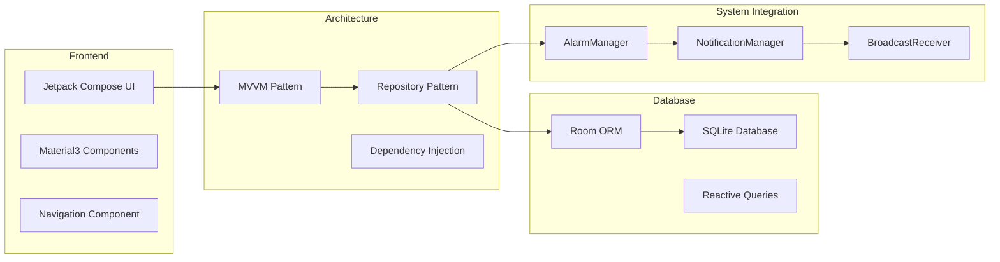

# 🛠️ CuraTrack Technical Implementation Guide

## 🏗️ Architecture Implementation Stack



## 🔧 Core Implementation Components

### **1. Database Layer Implementation**

```kotlin
// Entity Definitions
@Entity(tableName = "medicines")
data class MedicineEntity(
    @PrimaryKey val id: String = UUID.randomUUID().toString(),
    val userId: Long,
    val name: String,
    val dosage: String,
    val form: String,
    val instructions: String?,
    val color: String?,
    val icon: String?,
    val active: Boolean = true,
    val createdAt: Long = System.currentTimeMillis(),
    val updatedAt: Long = System.currentTimeMillis()
)

// DAO Implementation
@Dao
interface MedicineDao {
    @Query("SELECT * FROM medicines WHERE userId = :userId AND active = 1")
    fun getMedicinesByUser(userId: Long): Flow<List<MedicineEntity>>
    
    @Query("SELECT * FROM medicines WHERE id = :id AND userId = :userId")
    suspend fun getMedicineById(id: String, userId: Long): MedicineEntity?
    
    @Insert(onConflict = OnConflictStrategy.REPLACE)
    suspend fun insert(medicine: MedicineEntity)
    
    @Update
    suspend fun update(medicine: MedicineEntity)
    
    @Query("UPDATE medicines SET active = 0, updatedAt = :timestamp WHERE id = :id AND userId = :userId")
    suspend fun delete(id: String, userId: Long, timestamp: Long)
}
```

### **2. Repository Pattern Implementation**

```kotlin
@Singleton
class MedicineRepository @Inject constructor(
    private val medicineDao: MedicineDao,
    private val clock: () -> Long = { System.currentTimeMillis() }
) {
    // Reactive data streams
    fun getMedicines(userId: Long): Flow<List<MedicineEntity>> {
        return medicineDao.getMedicinesByUser(userId)
    }
    
    // Suspend operations
    suspend fun getMedicine(id: String, userId: Long): MedicineEntity? {
        return medicineDao.getMedicineById(id, userId)
    }
    
    suspend fun addMedicine(
        userId: Long,
        name: String,
        dosage: String,
        form: String,
        instructions: String? = null,
        color: String? = null,
        icon: String? = null
    ): String {
        val id = UUID.randomUUID().toString()
        val now = clock()
        val medicine = MedicineEntity(
            id = id,
            userId = userId,
            name = name,
            dosage = dosage,
            form = form,
            instructions = instructions,
            color = color,
            icon = icon,
            active = true,
            createdAt = now,
            updatedAt = now
        )
        medicineDao.insert(medicine)
        return id
    }
    
    suspend fun updateMedicine(medicine: MedicineEntity) {
        val updated = medicine.copy(updatedAt = clock())
        medicineDao.update(updated)
    }
    
    suspend fun deleteMedicine(id: String, userId: Long) {
        medicineDao.delete(id, userId, clock())
    }
}
```

### **3. Schedule Repository with Dose Generation**

```kotlin
@Singleton
class ScheduleRepository @Inject constructor(
    private val scheduleDao: ScheduleDao,
    private val clock: () -> Long = { System.currentTimeMillis() }
) {
    suspend fun createOrUpdateSchedule(
        userId: Long,
        medicineId: String,
        start: Long,
        end: Long?,
        timezoneId: String,
        frequencyType: String,
        timesJson: String?,
        intervalMinutes: Int?,
        daysOfWeekJson: String?,
        exactAlarm: Boolean,
        horizonDays: Int = 14
    ): String {
        val id = UUID.randomUUID().toString()
        val now = clock()
        
        val schedule = ScheduleEntity(
            id = id,
            userId = userId,
            medicineId = medicineId,
            startDateEpochMillis = start,
            endDateEpochMillis = end,
            timezoneId = timezoneId,
            frequencyType = frequencyType,
            timesJson = timesJson,
            intervalMinutes = intervalMinutes,
            daysOfWeekJson = daysOfWeekJson,
            exactAlarm = exactAlarm,
            createdAt = now,
            updatedAt = now
        )
        
        // Atomic transaction
        return scheduleDao.withTransaction {
            scheduleDao.upsertSchedule(schedule)
            
            // Generate doses
            val doses = generateDoses(schedule, horizonDays)
            scheduleDao.clearDoses(id)
            if (doses.isNotEmpty()) {
                scheduleDao.upsertDoses(doses)
            }
            
            id
        }
    }
    
    private fun generateDoses(schedule: ScheduleEntity, horizonDays: Int): List<DoseEntity> {
        val doses = mutableListOf<DoseEntity>()
        val startCal = Calendar.getInstance().apply { 
            timeInMillis = schedule.startDateEpochMillis 
        }
        val endLimit = schedule.endDateEpochMillis ?: 
            (startCal.timeInMillis + horizonDays * 24L * 60L * 60L * 1000L)
        val horizonLimit = startCal.timeInMillis + horizonDays * 24L * 60L * 60L * 1000L
        val limit = minOf(endLimit, horizonLimit)
        
        when (schedule.frequencyType.uppercase()) {
            "TIMES_PER_DAY" -> {
                val times = parseTimes(schedule.timesJson)
                val dayCal = Calendar.getInstance().apply { 
                    timeInMillis = startCal.timeInMillis 
                }
                
                while (dayCal.timeInMillis <= limit) {
                    for ((hour, minute) in times) {
                        val doseCal = dayCal.clone() as Calendar
                        doseCal.set(Calendar.HOUR_OF_DAY, hour)
                        doseCal.set(Calendar.MINUTE, minute)
                        doseCal.set(Calendar.SECOND, 0)
                        doseCal.set(Calendar.MILLISECOND, 0)
                        
                        val doseTime = doseCal.timeInMillis
                        if (doseTime >= schedule.startDateEpochMillis && doseTime <= limit) {
                            doses.add(DoseEntity(
                                id = UUID.randomUUID().toString(),
                                scheduleId = schedule.id,
                                timeEpochMillis = doseTime,
                                generatedFrom = "SCHEDULE"
                            ))
                        }
                    }
                    dayCal.add(Calendar.DAY_OF_YEAR, 1)
                }
            }
            
            "INTERVAL" -> {
                val interval = (schedule.intervalMinutes ?: 0).coerceAtLeast(0)
                if (interval > 0) {
                    var currentTime = schedule.startDateEpochMillis
                    while (currentTime <= limit) {
                        doses.add(DoseEntity(
                            id = UUID.randomUUID().toString(),
                            scheduleId = schedule.id,
                            timeEpochMillis = currentTime,
                            generatedFrom = "SCHEDULE"
                        ))
                        currentTime += interval * 60L * 1000L
                    }
                }
            }
            
            "WEEKLY" -> {
                val times = parseTimes(schedule.timesJson)
                val selectedDays = parseDays(schedule.daysOfWeekJson)
                val dayCal = Calendar.getInstance().apply { 
                    timeInMillis = startCal.timeInMillis 
                }
                
                while (dayCal.timeInMillis <= limit) {
                    if (selectedDays.contains(dayCal.get(Calendar.DAY_OF_WEEK))) {
                        for ((hour, minute) in times) {
                            val doseCal = dayCal.clone() as Calendar
                            doseCal.set(Calendar.HOUR_OF_DAY, hour)
                            doseCal.set(Calendar.MINUTE, minute)
                            doseCal.set(Calendar.SECOND, 0)
                            doseCal.set(Calendar.MILLISECOND, 0)
                            
                            val doseTime = doseCal.timeInMillis
                            if (doseTime >= schedule.startDateEpochMillis && doseTime <= limit) {
                                doses.add(DoseEntity(
                                    id = UUID.randomUUID().toString(),
                                    scheduleId = schedule.id,
                                    timeEpochMillis = doseTime,
                                    generatedFrom = "SCHEDULE"
                                ))
                            }
                        }
                    }
                    dayCal.add(Calendar.DAY_OF_YEAR, 1)
                }
            }
        }
        
        return doses.sortedBy { it.timeEpochMillis }
    }
}
```

### **4. UI Layer Implementation**

```kotlin
// ViewModel for AddScheduleScreen
@HiltViewModel
class AddScheduleViewModel @Inject constructor(
    private val scheduleRepository: ScheduleRepository,
    private val medicineRepository: MedicineRepository,
    savedStateHandle: SavedStateHandle
) : ViewModel() {
    
    private val userId = savedStateHandle.get<Long>("userId") ?: 0L
    private val medicineId = savedStateHandle.get<String>("medicineId") ?: ""
    
    private val _medicine = MutableStateFlow<MedicineEntity?>(null)
    val medicine: StateFlow<MedicineEntity?> = _medicine.asStateFlow()
    
    private val _uiState = MutableStateFlow(AddScheduleUiState())
    val uiState: StateFlow<AddScheduleUiState> = _uiState.asStateFlow()
    
    init {
        loadMedicine()
    }
    
    private fun loadMedicine() {
        viewModelScope.launch {
            try {
                val med = medicineRepository.getMedicine(medicineId, userId)
                _medicine.value = med
            } catch (e: Exception) {
                // Handle error
            }
        }
    }
    
    fun createSchedule(
        frequencyType: String,
        selectedTimes: List<String>,
        startDate: LocalDate,
        endDate: LocalDate?,
        // ... other parameters
    ) {
        viewModelScope.launch {
            try {
                _uiState.value = _uiState.value.copy(isLoading = true)
                
                val start = startDate.atStartOfDay(ZoneId.systemDefault())
                    .toInstant().toEpochMilli()
                val end = endDate?.atStartOfDay(ZoneId.systemDefault())
                    ?.toInstant()?.toEpochMilli()
                
                val timesJson = if (selectedTimes.isNotEmpty()) {
                    selectedTimes.joinToString(
                        prefix = "[\"", 
                        separator = "\",\"", 
                        postfix = "\"]"
                    )
                } else null
                
                scheduleRepository.createOrUpdateSchedule(
                    userId = userId,
                    medicineId = medicineId,
                    start = start,
                    end = end,
                    timezoneId = ZoneId.systemDefault().id,
                    frequencyType = frequencyType,
                    timesJson = timesJson,
                    // ... other parameters
                )
                
                _uiState.value = _uiState.value.copy(
                    isLoading = false,
                    isSuccess = true
                )
                
            } catch (e: Exception) {
                _uiState.value = _uiState.value.copy(
                    isLoading = false,
                    errorMessage = e.message
                )
            }
        }
    }
}

data class AddScheduleUiState(
    val isLoading: Boolean = false,
    val isSuccess: Boolean = false,
    val errorMessage: String? = null
)
```

### **5. Notification System Implementation**

```kotlin
// Enhanced DoseAlarmReceiver
class DoseAlarmReceiver : BroadcastReceiver() {
    
    override fun onReceive(context: Context, intent: Intent) {
        val medicineId = intent.getStringExtra(EXTRA_MEDICINE_ID) ?: return
        
        NotificationHelper.ensureChannel(context)
        showRichNotification(context, medicineId)
    }
    
    private fun showRichNotification(context: Context, medicineId: String) {
        // Create pending intent for app opening
        val appIntent = Intent(context, MainActivity::class.java).apply {
            flags = Intent.FLAG_ACTIVITY_NEW_TASK or Intent.FLAG_ACTIVITY_CLEAR_TASK
        }
        val appPendingIntent = PendingIntent.getActivity(
            context, 0, appIntent,
            PendingIntent.FLAG_UPDATE_CURRENT or PendingIntent.FLAG_IMMUTABLE
        )
        
        // Create action intents
        val takenIntent = createActionIntent(context, medicineId, DoseActionReceiver.ACTION_TAKEN)
        val snoozeIntent = createActionIntent(context, medicineId, DoseActionReceiver.ACTION_SNOOZE)
        
        val takenPendingIntent = PendingIntent.getBroadcast(
            context, medicineId.hashCode(), takenIntent,
            PendingIntent.FLAG_UPDATE_CURRENT or PendingIntent.FLAG_IMMUTABLE
        )
        
        val snoozePendingIntent = PendingIntent.getBroadcast(
            context, medicineId.hashCode() + 1, snoozeIntent,
            PendingIntent.FLAG_UPDATE_CURRENT or PendingIntent.FLAG_IMMUTABLE
        )
        
        // Build rich notification
        val notification = NotificationCompat.Builder(context, NotificationHelper.CHANNEL_ID)
            .setSmallIcon(R.drawable.ic_launcher_foreground)
            .setContentTitle("💊 Medicine Reminder")
            .setContentText("Time to take: $medicineId")
            .setStyle(NotificationCompat.BigTextStyle()
                .bigText("It's time to take your medicine: $medicineId\n\n" +
                        "Tap 'Taken' if you've taken it, or 'Snooze' to be reminded again in 10 minutes."))
            .setPriority(NotificationCompat.PRIORITY_HIGH)
            .setCategory(NotificationCompat.CATEGORY_REMINDER)
            .setAutoCancel(true)
            .setContentIntent(appPendingIntent)
            .addAction(R.drawable.ic_launcher_foreground, "✓ Taken", takenPendingIntent)
            .addAction(R.drawable.ic_launcher_foreground, "⏰ Snooze 10min", snoozePendingIntent)
            .setDefaults(NotificationCompat.DEFAULT_ALL)
            .build()
        
        val notificationId = NOTIFICATION_ID_BASE + medicineId.hashCode()
        NotificationManagerCompat.from(context).notify(notificationId, notification)
    }
    
    private fun createActionIntent(context: Context, medicineId: String, action: String): Intent {
        return Intent(context, DoseActionReceiver::class.java).apply {
            this.action = action
            putExtra(EXTRA_MEDICINE_ID, medicineId)
        }
    }
    
    companion object {
        const val EXTRA_MEDICINE_ID = "medicine_id"
        private const val NOTIFICATION_ID_BASE = 2000
    }
}

// DoseActionReceiver for handling notification actions
class DoseActionReceiver : BroadcastReceiver() {
    
    override fun onReceive(context: Context, intent: Intent) {
        val medicineId = intent.getStringExtra(DoseAlarmReceiver.EXTRA_MEDICINE_ID) ?: return
        
        when (intent.action) {
            ACTION_TAKEN -> handleTakenAction(context, medicineId)
            ACTION_SNOOZE -> handleSnoozeAction(context, medicineId)
        }
    }
    
    private fun handleTakenAction(context: Context, medicineId: String) {
        // Dismiss notification
        dismissNotification(context, medicineId)
        
        // TODO: Mark dose as taken in database
        // This could update a "taken" status in the doses table
    }
    
    private fun handleSnoozeAction(context: Context, medicineId: String) {
        // Dismiss current notification
        dismissNotification(context, medicineId)
        
        // Schedule snooze alarm (10 minutes later)
        val snoozeTime = System.currentTimeMillis() + SNOOZE_DURATION_MILLIS
        AlarmScheduler.scheduleExactDose(context, snoozeTime, medicineId)
    }
    
    private fun dismissNotification(context: Context, medicineId: String) {
        val notificationId = 2000 + medicineId.hashCode()
        NotificationManagerCompat.from(context).cancel(notificationId)
    }
    
    companion object {
        const val ACTION_TAKEN = "com.curatrack.app.ACTION_TAKEN"
        const val ACTION_SNOOZE = "com.curatrack.app.ACTION_SNOOZE"
        private const val SNOOZE_DURATION_MILLIS = 10 * 60 * 1000L // 10 minutes
    }
}
```

## 📋 Implementation Checklist

### **Database Setup**
- [ ] Room database configuration
- [ ] Entity definitions with proper annotations
- [ ] DAO interfaces with reactive queries
- [ ] Repository implementations with error handling
- [ ] Database migrations for future updates

### **UI Implementation**
- [ ] ViewModels with proper state management
- [ ] Composable screens with reactive data binding
- [ ] Navigation setup with parameter passing
- [ ] Form validation and error handling
- [ ] Loading states and progress indicators

### **Notification System**
- [ ] AlarmManager integration for precise timing
- [ ] Rich notification creation with actions
- [ ] Broadcast receiver registration in manifest
- [ ] Permission handling for notifications and exact alarms
- [ ] Snooze functionality with rescheduling

### **Testing Strategy**
- [ ] Unit tests for repositories and ViewModels
- [ ] Database tests with in-memory database
- [ ] UI tests with Compose testing framework
- [ ] Integration tests for complete flows
- [ ] Notification testing with mock receivers

### **Performance Optimization**
- [ ] Database queries with proper indexing
- [ ] Lazy loading for large datasets
- [ ] Memory leak prevention with Flow usage
- [ ] Background thread usage for heavy operations
- [ ] Efficient notification scheduling

This technical implementation provides a solid foundation for a scalable, maintainable medicine scheduling system! 🚀