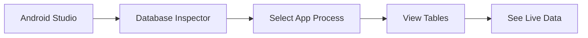

# 📱 How to View SQLite Database in Your CuraTrack Android App

## 🔍 **Multiple Methods to View Your Database**

Your CuraTrack app stores data in a SQLite database named `curatrack.db`. Here are the best ways to view it:

## 📊 **Method 1: Android Studio Database Inspector (RECOMMENDED)**

### **✅ Easiest and Most Visual Method**

**Step 1: Setup**
1. Open your CuraTrack project in Android Studio
2. Run your app on an emulator or connected device (USB debugging enabled)
3. Use your app to add some medicines and schedules

**Step 2: Open Database Inspector**
1. In Android Studio, go to **View → Tool Windows → App Inspection**
2. OR click on the **Database Inspector** tab at the bottom
3. Select your running app process: `com.curatrack.app`

**Step 3: Explore Your Database**
- You'll see your `curatrack.db` database
- Expand to see all 4 tables: `users`, `medicines`, `schedules`, `doses`
- Click on any table to view its data in a nice table format
- You can run live SQL queries
- Data updates in real-time as you use the app



---

## 📂 **Method 2: ADB Commands (Command Line)**

### **For Command Line Users**

**Step 1: Connect to Device**
```bash
# Check connected devices
adb devices

# Connect to device shell
adb shell
```

**Step 2: Navigate to Database**
```bash
# Navigate to your app's database directory
cd /data/data/com.curatrack.app/databases/

# List database files
ls -la
```

**Step 3: Open SQLite Command Line**
```bash
# Open the database in SQLite
sqlite3 curatrack.db

# View all tables
.tables

# View table structure
.schema medicines

# Query data
SELECT * FROM medicines;
SELECT * FROM schedules;
SELECT * FROM doses;
SELECT * FROM users;

# Exit SQLite
.exit
```

**Sample Commands for Your CuraTrack Database:**
```sql
-- View all medicines
SELECT id, name, dosage, form, instructions FROM medicines;

-- View all schedules with medicine names
SELECT s.id, m.name, s.frequencyType, s.timesJson, s.startDateEpochMillis 
FROM schedules s 
JOIN medicines m ON s.medicineId = m.id;

-- View upcoming doses
SELECT d.timeEpochMillis, m.name, datetime(d.timeEpochMillis/1000, 'unixepoch') as dose_time
FROM doses d 
JOIN schedules s ON d.scheduleId = s.id 
JOIN medicines m ON s.medicineId = m.id 
WHERE d.timeEpochMillis > strftime('%s','now') * 1000
ORDER BY d.timeEpochMillis;

-- Count items in each table
SELECT 'users' as table_name, COUNT(*) as count FROM users
UNION ALL
SELECT 'medicines', COUNT(*) FROM medicines  
UNION ALL
SELECT 'schedules', COUNT(*) FROM schedules
UNION ALL
SELECT 'doses', COUNT(*) FROM doses;
```

---

## 💾 **Method 3: Extract Database File to PC**

### **For Detailed Analysis**

**Step 1: Pull Database to Your PC**
```bash
# Pull the database file to your computer
adb pull /data/data/com.curatrack.app/databases/curatrack.db C:\Users\Asus\Desktop\curatrack.db

# Alternative: Pull entire databases folder
adb pull /data/data/com.curatrack.app/databases/ C:\Users\Asus\Desktop\curatrack_db_backup\
```

**Step 2: Open with SQLite Browser**
1. Download **DB Browser for SQLite** (free): https://sqlitebrowser.org/
2. Install it on your Windows machine
3. Open the extracted `curatrack.db` file
4. Browse data, execute queries, and analyze structure

---

## 🛠️ **Method 4: Add Debug Logging to Your App**

### **For Real-time Monitoring**

Add this debugging code to your repositories:

**MedicineRepository Debug Logging:**
```kotlin
class MedicineRepository @Inject constructor(
    private val medicineDao: MedicineDao,
    private val clock: () -> Long = { System.currentTimeMillis() }
) {
    fun getMedicines(userId: Long): Flow<List<MedicineEntity>> {
        return medicineDao.getMedicinesByUser(userId)
            .onEach { medicines ->
                Log.d("DATABASE_DEBUG", "Loaded ${medicines.size} medicines:")
                medicines.forEach { medicine ->
                    Log.d("DATABASE_DEBUG", "Medicine: ${medicine.name} - ${medicine.dosage} ${medicine.form}")
                }
            }
    }
    
    suspend fun addMedicine(
        userId: Long,
        name: String,
        dosage: String,
        form: String,
        // ... other params
    ): String {
        val id = UUID.randomUUID().toString()
        // ... existing code ...
        
        Log.d("DATABASE_DEBUG", "Added medicine: $name ($dosage $form) with ID: $id")
        return id
    }
}
```

**ScheduleRepository Debug Logging:**
```kotlin
suspend fun createOrUpdateSchedule(/* params */): String {
    // ... existing code ...
    
    Log.d("DATABASE_DEBUG", "Created schedule for medicine $medicineId:")
    Log.d("DATABASE_DEBUG", "- Frequency: $frequencyType")
    Log.d("DATABASE_DEBUG", "- Times: $timesJson")
    Log.d("DATABASE_DEBUG", "- Generated ${doses.size} dose entries")
    
    return id
}
```

**View Logs in Android Studio:**
1. Open **Logcat** in Android Studio
2. Filter by tag: `DATABASE_DEBUG`
3. Use your app and watch real-time database operations

---

## 🔧 **Method 5: Custom Debug Screen (Advanced)**

### **Add a Debug Screen to Your App**

Create a debug screen that shows database contents:

```kotlin
@Composable
fun DebugDatabaseScreen(
    medicineRepo: MedicineRepository,
    scheduleRepo: ScheduleRepository,
    userId: Long
) {
    val medicines by medicineRepo.getMedicines(userId).collectAsState(initial = emptyList())
    val upcomingDoses by scheduleRepo.getUpcomingDoses(userId).collectAsState(initial = emptyList())
    
    LazyColumn(
        modifier = Modifier.padding(16.dp),
        verticalArrangement = Arrangement.spacedBy(8.dp)
    ) {
        item {
            Text("DATABASE DEBUG", style = MaterialTheme.typography.headlineMedium)
        }
        
        item {
            Card {
                Column(modifier = Modifier.padding(16.dp)) {
                    Text("Medicines (${medicines.size})", style = MaterialTheme.typography.titleMedium)
                    medicines.forEach { medicine ->
                        Text("• ${medicine.name} - ${medicine.dosage} ${medicine.form}")
                    }
                }
            }
        }
        
        item {
            Card {
                Column(modifier = Modifier.padding(16.dp)) {
                    Text("Upcoming Doses (${upcomingDoses.size})", style = MaterialTheme.typography.titleMedium)
                    upcomingDoses.forEach { dose ->
                        val time = SimpleDateFormat("MMM dd, HH:mm", Locale.getDefault())
                            .format(Date(dose.timeEpochMillis))
                        Text("• ${dose.medicineName} at $time")
                    }
                }
            }
        }
    }
}
```

Add navigation to this debug screen in development builds.

---

## 🎯 **Quick Database Inspection Workflow**

### **For Your CuraTrack App:**

1. **🚀 Start Your App**
   - Run on emulator or device
   - Add some medicines and schedules

2. **👁️ Open Database Inspector**
   - Android Studio → View → App Inspection
   - Select your app process

3. **📊 View Your Data**
   - Click on `medicines` table → See your added medicines
   - Click on `schedules` table → See your schedule rules
   - Click on `doses` table → See generated dose times

4. **🔍 Run Queries**
   ```sql
   -- See all medicines with their schedules
   SELECT m.name, s.frequencyType, s.timesJson 
   FROM medicines m 
   JOIN schedules s ON m.id = s.medicineId;
   
   -- See upcoming doses with readable timestamps
   SELECT 
       m.name as medicine_name,
       datetime(d.timeEpochMillis/1000, 'unixepoch', 'localtime') as dose_time
   FROM doses d
   JOIN schedules s ON d.scheduleId = s.id  
   JOIN medicines m ON s.medicineId = m.id
   WHERE d.timeEpochMillis > (strftime('%s','now') * 1000)
   ORDER BY d.timeEpochMillis
   LIMIT 10;
   ```

---

## ⚡ **Quick Commands Cheat Sheet**

```bash
# Connect to database via ADB
adb shell
cd /data/data/com.curatrack.app/databases/
sqlite3 curatrack.db

# Essential SQLite commands
.tables                          # List all tables
.schema table_name              # Show table structure
SELECT * FROM medicines;        # View all medicines
SELECT * FROM schedules;        # View all schedules
SELECT COUNT(*) FROM doses;     # Count doses
.exit                          # Exit SQLite

# Pull database to PC
adb pull /data/data/com.curatrack.app/databases/curatrack.db ./curatrack.db
```

## 🎉 **Recommended Approach**

For your CuraTrack app, I recommend:

1. **Primary**: Use **Android Studio Database Inspector** for visual inspection
2. **Backup**: Use **ADB + SQLite commands** for detailed queries
3. **Analysis**: Pull database file and use **DB Browser for SQLite** for complex analysis

The Database Inspector is perfect for seeing your medicines, schedules, and doses in real-time as you use the app! 🚀